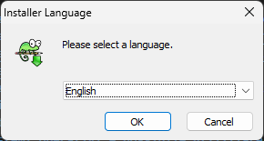
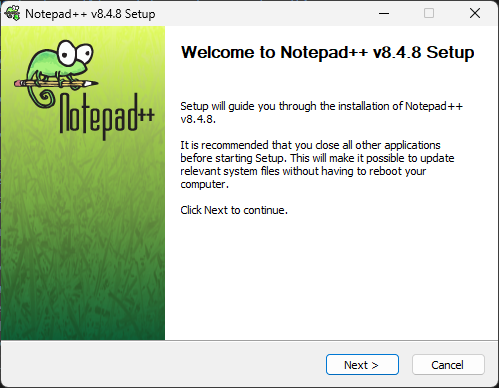
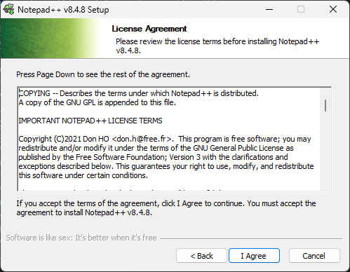
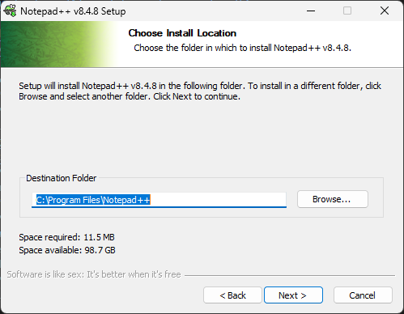
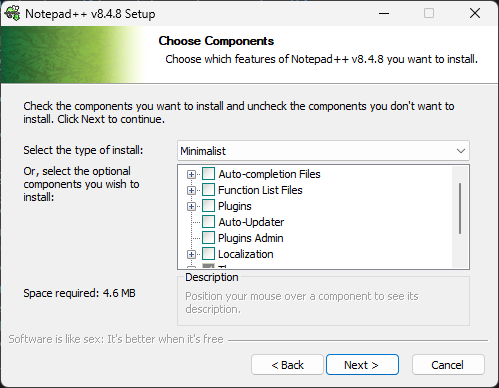
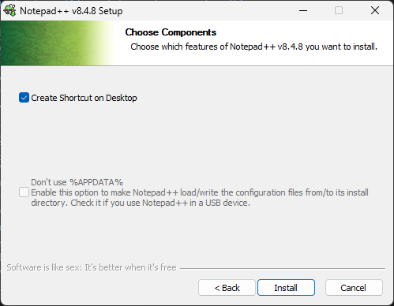
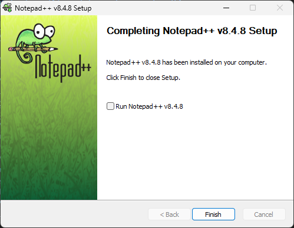

# **Lezione 1 git - sviluppo MAPOD4D**

 
 

# Prerequisiti lezione
1. ### Aver seguito la lezione registrata online: **"Etica e storia del FLOSS nel contesto del progetto MAPOD4D"**
    - ### [Link alla lezione]
2. ### Aver seguito la lezione **"FLOSS flusso di lavoro MAPOD4D"**
    - ### [Link alla presentazione]
3. ### Aver letto i seguenti documenti:
    - ### [Documento tecnico](https://github.com/mapod4d/docs/blob/master/it/c1/it_documento_tecnico_mapod4d.pdf)
    - ### [Linee guida](https://github.com/mapod4d/docs/blob/master/mapod4d_guidelines_lineeguida.pdf)
    - ### [Specifica dei formati](https://github.com/mapod4d/docs/blob/master/it/all/it_mapod4d_documento_unico_formati.pdf)

 
 

# Software necessario
## **GIT**
### Per chi utilizza il sistema operativo **Microsoft Windows** scaricare il software git al da [questo link](https://github.com/git-for-windows/git/releases/download/v2.39.1.windows.1/Git-2.39.1-64-bit.exe), installare il software senza modificare le opzioni richieste durante la procedura di installazione.
### Per chi utilizza il sistema operativo **GNU Linux** seguire le istruzioni della distribuzione in uso.
## **Editor di testo**
### Per tutti i sistemi operativi è possibile utilizzare il software preferito.
### Un word preocessor (tipo LibreOffice write) non è adatto, occorre un software che sia esclusivamente un editor di testo.
### Per chi non usa il sistema operativo **Microsoft Windows** e voglia un editor semplice consiglio **notepad++** [scaricabile qui](https://github.com/notepad-plus-plus/notepad-plus-plus/releases/download/v8.4.8/npp.8.4.8.Installer.x64.exe), per installarlo potete vedere alla fine di questo documento le risposte da dare dopo aver lanciato il file scaricato.
### Ecco un breve elenco di altri editor di testo adatti alla scopo, richiedono esperienza e conoscienze specifiche:
- [GVim](https://github.com/vim/vim-win32-installer/releases)
- [Neovim](https://github.com/neovim/neovim/releases/download/stable/nvim-win64.zip)
- [Scintilla](https://www.scintilla.org/wscite532.zip)
- [VSCodium](https://github.com/VSCodium/vscodium/releases/download/1.74.3.23010/VSCodiumSetup-x64-1.74.3.23010.exe)
### Per chi utilizza il sistema operativo **GNU Linux** consiglio installare vim, neovim o equivalenti solo se ne conosce l'uso.

  

# Installazione notepad++
### Ecco quali risposte dare ai parametri d'installazione.

